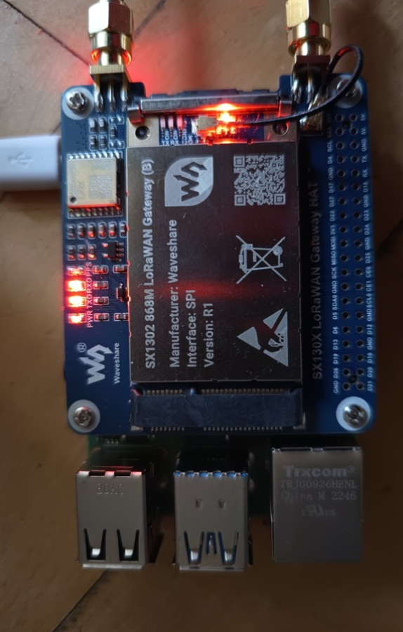

Teil1 :
LoRaWAN Gateway mit Rasperry 4B und Waveshare SX1302 868M HAT

_____________________________________________
Hardware:

Raspberry Pi 4B / mit Pi OS (Legacy, 32-bit)

Waveshare SX1302 868M LoRaWAN Gateway (B) 

SPI-Version R1 

Frequenzband: EU868 

The Things Network / The Things Stack 

Raspberry-Pi-Benutzer: pi 
________________________________________

1. Ziel der Installation
   
Der Raspberry Pi 4B wird als LoRaWAN-Gateway eingerichtet.

Der Datenweg ist:

LoRaWAN-Sensor

      │
      │ 868 MHz
      ▼

Waveshare SX1302

      │
      │ SPI
      ▼

Raspberry Pi 4

      │
      │ Internet
      ▼

The Things Network

      │
      ▼

TTN Application / MQTT / API

Der SX1302 übernimmt dabei den LoRaWAN-Funkempfang und der Raspberry Pi leitet die empfangenen Daten an TTN weiter.
________________________________________
Dokumentation in : Installation_Raspi4_SX1302_Gateway.pdf

verwendetes JSON- File : global_conf.json
